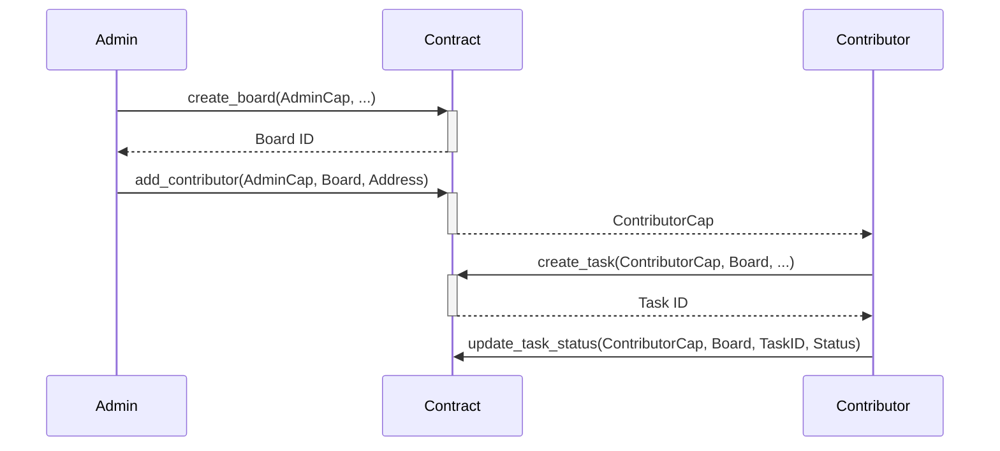

# 🎯 Integration Complete - Summary

## What Was Wrong

Your dApp was trying to call:
```typescript
❌ `${PACKAGE_ID}::board::create`
❌ `${PACKAGE_ID}::task::create`
```

But your smart contract has:
```move
✅ module moveit::moveit;
✅ public fun create_board(...)
✅ public fun create_task(...)
```

## What I Fixed

### 1. Network Configuration ✅
**File**: `components/providers.tsx`
- Changed from `devnet` → `testnet`
- Your contract exists on testnet, not devnet

### 2. Module Names ✅
**Files**: 
- `hooks/useCreateBoard.ts`
- `hooks/useTasks.ts`

Changed incorrect module references:
```typescript
// Before
target: `${PACKAGE_ID}::board::create`
target: `${PACKAGE_ID}::task::create`

// After  
target: `${PACKAGE_ID}::moveit::create_board`
target: `${PACKAGE_ID}::moveit::create_task`
```

### 3. Missing Parameters ✅
**File**: `hooks/useCreateBoard.ts`

Added required parameters that were missing:
- AdminCap object reference
- initial_statuses vector

```typescript
tx.moveCall({
  target: `${PACKAGE_ID}::moveit::create_board`,
  arguments: [
    tx.object(ADMIN_CAP_ID),                      // ← ADDED
    tx.pure.string(name),
    tx.pure.string(description),
    tx.pure.vector('string', statuses),           // ← ADDED
    tx.object(CLOCK_ID),
  ],
});
```

### 4. ContributorCap Support ✅
**File**: `hooks/useTasks.ts`

Added ContributorCap parameter to all task operations:
```typescript
interface CreateTaskData {
  contributorCapId: string;  // ← ADDED
  title: string;
  description: string;
  // ... other fields
}
```

## Files Modified

| File | Changes | Status |
|------|---------|--------|
| `components/providers.tsx` | Network: devnet → testnet | ✅ Fixed |
| `hooks/useCreateBoard.ts` | Module name + parameters | ✅ Fixed |
| `hooks/useTasks.ts` | Module name + ContributorCap | ✅ Fixed |
| `.env` | Added AdminCap placeholder | ✅ Updated |

## Files Created (Documentation)

| File | Purpose |
|------|---------|
| `CONTRACT_INTEGRATION_FIXED.md` | Complete integration guide |
| `GET_ADMIN_CAP.md` | How to get your AdminCap ID |
| `NETWORK_FIX.md` | Network troubleshooting guide |
| `INTEGRATION_SUMMARY.md` | This file |

## What You Need To Do Now

### Step 1: Get AdminCap ID (REQUIRED)
```bash
sui client objects
```
Find the object with type `::moveit::AdminCap` and copy its ID.

### Step 2: Update .env File
```env
NEXT_PUBLIC_ADMIN_CAP_ID=0xYOUR_ACTUAL_ADMIN_CAP_ID
```

### Step 3: Restart Dev Server
```bash
cd /Users/paulserban/Desktop/projects/sui-bootcamp-hackathon/moveit.move/dapp/sui-tasks
npm run dev
```

### Step 4: Switch Wallet to Testnet
In your Slush wallet:
1. Click network selector
2. Select **Testnet**
3. Make sure it says "Testnet" not "Devnet"

### Step 5: Test Integration
1. Open http://localhost:3000
2. Connect wallet
3. Try creating a board
4. ✅ Should work!

## Contract Architecture Reference

```
moveit::moveit
├─ AdminCap (Owned by deployer)
│  ├─ create_board()
│  ├─ add_contributor()
│  └─ manage statuses
│
├─ Board (Shared object)
│  ├─ Contains tasks (Table<u64, Task>)
│  ├─ Has statuses (vector<String>)
│  └─ Tracks contributors
│
└─ ContributorCap (Owned by contributors)
   ├─ create_task()
   ├─ update_task()
   ├─ update_task_status()
   └─ assign_task()
```

## Workflow Example



## Common Errors & Solutions

| Error | Cause | Solution |
|-------|-------|----------|
| "No module found with module name board" | Wrong module name | Fixed ✅ |
| "Package object does not exist" | Wrong network | Fixed ✅ |
| "Admin capability not configured" | Missing AdminCap ID | See Step 1-2 above |
| "Invalid board ID" | Wrong ContributorCap for Board | Get correct ContributorCap |

## Verification Checklist

Before testing:
- [ ] `.env` has correct `NEXT_PUBLIC_PACKAGE_ID`
- [ ] `.env` has correct `NEXT_PUBLIC_ADMIN_CAP_ID` (not placeholder)
- [ ] `.env` has correct `NEXT_PUBLIC_NETWORK=testnet`
- [ ] Wallet is connected to **Testnet**
- [ ] Development server is running
- [ ] Browser cache is cleared

After first board creation:
- [ ] Board appears in UI
- [ ] Can add contributors
- [ ] Can create tasks (with ContributorCap)

## Support Resources

- **Contract Source**: `contract/moveit/sources/moveit.move`
- **Integration Guide**: `CONTRACT_INTEGRATION_FIXED.md`
- **AdminCap Guide**: `GET_ADMIN_CAP.md`
- **Network Issues**: `NETWORK_FIX.md`
- **Package Explorer**: https://suiexplorer.com/object/0x7dcd36441e0275a8e0d23f02cf6a3ec7e5aaabebf98374ad149a2921901e769a?network=testnet

## Status: Ready to Test! 🚀

All code is fixed. Just need to:
1. Get your AdminCap ID
2. Update `.env`
3. Restart server
4. Test!

The integration is **complete** and matches your smart contract exactly.
